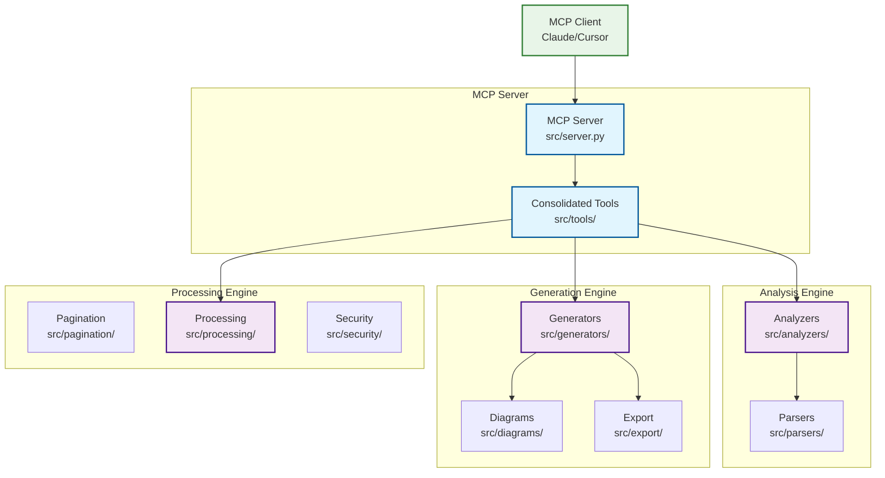

# Document-Automation

[](https://www.python.org/downloads/)
[](https://modelcontextprotocol.io/)
[](https://www.typescriptlang.org/)

**Document-Automation** is a comprehensive MCP (Model Context Protocol) server that provides intelligent codebase analysis, documentation generation, and automated reporting capabilities. It offers powerful tools for analyzing codebases, generating professional documentation, and exporting content in multiple formats.

## 🚀 Features

### Core Analysis Capabilities
- **Comprehensive Codebase Analysis**: Deep analysis of project structure, dependencies, and code metrics
- **Multi-Language Support**: Python, TypeScript, JavaScript parsing with AST analysis
- **Framework Detection**: Automatic detection of web frameworks and technology stacks
- **Database Schema Analysis**: ORM models and SQL schema extraction
- **API Endpoint Discovery**: Automatic API endpoint extraction and documentation
- **Security Analysis**: Security vulnerability scanning and compliance checking

### Documentation Generation
- **Professional Documentation**: High-quality documentation with multiple themes and formats
- **Interactive HTML**: Interactive documentation with search, navigation, and live diagrams
- **Multi-Format Export**: Support for Markdown, HTML, PDF, and DOCX formats
- **Mermaid Diagrams**: Automatic generation of architecture, dependency, and flow diagrams
- **Responsive Design**: Mobile-friendly documentation with accessibility compliance

### Advanced Features
- **Smart Pagination**: Handle large repositories with intelligent chunking
- **Background Processing**: Concurrent analysis for performance optimization
- **Context Management**: Efficient memory usage with token-aware processing
- **Multi-Language Support**: Documentation generation in multiple languages
- **Custom Themes**: Customizable themes and branding options

## 📁 Project Structure

```
Document-Automation/
├── src/                          # Source code
│   ├── analyzers/               # Codebase analysis modules
│   │   ├── base_analyzer.py     # Base analyzer class
│   │   ├── codebase_analyzer.py # Main codebase analyzer
│   │   ├── database_analyzer.py # Database schema analyzer
│   │   └── framework_detector.py # Framework detection
│   ├── diagrams/                # Diagram generation
│   │   ├── architecture_diagrams.py # Architecture diagrams
│   │   ├── database_diagrams.py     # Database ER diagrams
│   │   └── mermaid_generator.py     # Mermaid diagram generator
│   ├── export/                  # Export functionality
│   │   └── format_exporter.py   # Multi-format exporter
│   ├── generators/              # Documentation generators
│   │   ├── documentation_generator.py      # Base generator
│   │   ├── interactive_doc_generator.py    # Interactive HTML
│   │   └── professional_doc_generator.py   # Professional docs
│   ├── pagination/              # Pagination and chunking
│   │   ├── chunker.py           # Content chunking
│   │   ├── context.py           # Context management
│   │   ├── strategies.py        # Pagination strategies
│   │   └── token_estimator.py   # Token estimation
│   ├── parsers/                 # Language parsers
│   │   ├── ast_analyzer.py      # AST analysis
│   │   ├── base_parser.py       # Base parser class
│   │   ├── javascript_parser.py # JavaScript parser
│   │   ├── parser_factory.py    # Parser factory
│   │   └── python_parser.py     # Python parser
│   ├── processing/              # Background processing
│   │   ├── background_processor.py # Background tasks
│   │   └── concurrent_analyzer.py  # Concurrent analysis
│   ├── security/                # Security features
│   │   └── validation.py        # Input validation
│   ├── tools/                   # MCP tools
│   │   └── consolidated_documentation_tools.py # Main tools
│   ├── schemas.py               # Data schemas
│   └── server.py               # MCP server entry point
├── requirements.txt            # Python dependencies
├── package.json               # Node.js dependencies
├── tsconfig.json             # TypeScript configuration
└── wrangler.toml             # Cloudflare Workers config
```

## 🛠 Installation

### Prerequisites
- **Python 3.10+** with pip or uv
- **Node.js 18+** (for TypeScript components)
- **Git** (for repository analysis)

### Using uv (Recommended)
```bash
# Clone the repository
git clone https://github.com/vedantparmar12/Document-Automation.git
cd Document-Automation

# Create virtual environment and install dependencies
uv sync

# Run the MCP server
uv run python src/server.py
```

### Using pip
```bash
# Clone the repository
git clone https://github.com/vedantparmar12/Document-Automation.git
cd Document-Automation

# Create virtual environment
python -m venv .venv
source .venv/bin/activate  # On Windows: .venv\Scripts\activate

# Install dependencies
pip install -r requirements.txt

# Run the MCP server
python src/server.py
```

### Node.js Dependencies
```bash
# Install Node.js dependencies for TypeScript support
npm install
```

## 🔧 Configuration

### MCP Client Configuration

#### Claude Desktop
Add to your Claude Desktop configuration file:

```json
{
  "mcpServers": {
    "document-automation": {
      "command": "uv",
      "args": [
        "--directory",
        "/path/to/Document-Automation",
        "run",
        "python",
        "src/server.py"
      ]
    }
  }
}
```

#### Cursor IDE
Add to your Cursor MCP configuration:

```json
{
  "servers": {
    "document-automation": {
      "url": "stdio://uv --directory /path/to/Document-Automation run python src/server.py",
      "name": "Document Automation",
      "description": "Codebase analysis and documentation generation"
    }
  }
}
```

### Environment Variables
```bash
# Optional: Set custom configuration
export DOC_OUTPUT_DIR="./docs"
export DOC_MAX_TOKENS="4000"
export DOC_THEME="modern"
```

## 🎯 Usage

### Available MCP Tools

#### 1. Analyze Codebase
Comprehensive codebase analysis with all features built-in:

```json
{
  "tool": "analyze_codebase",
  "arguments": {
    "path": "https://github.com/user/repo",
    "source_type": "github",
    "include_dependencies": true,
    "include_ast_analysis": true,
    "include_framework_detection": true,
    "include_database_analysis": true,
    "include_mermaid_diagrams": true,
    "include_security_analysis": true,
    "include_api_endpoints": true
  }
}
```

Features included:
- **Project Structure Analysis**: Complete file tree with metadata
- **Dependency Analysis**: Package dependencies with security checks
- **AST Parsing**: Detailed code structure and complexity metrics
- **Framework Detection**: Technology stack identification
- **Database Schema Analysis**: ORM models and SQL schema extraction
- **API Endpoint Discovery**: REST/GraphQL endpoint documentation
- **Mermaid Diagrams**: Architecture, dependency, and flow diagrams
- **Security Analysis**: Vulnerability scanning and compliance checks

#### 2. Generate Documentation
Professional documentation generation with multiple formats:

```json
{
  "tool": "generate_documentation",
  "arguments": {
    "analysis_id": "analysis_xxx",
    "format": "professional",
    "theme": "modern",
    "include_api_docs": true,
    "include_examples": true,
    "include_architecture": true,
    "include_mermaid_diagrams": true
  }
}
```

Supported formats:
- **Professional**: Comprehensive documentation with all sections
- **Minimal**: Clean, focused documentation
- **Academic**: Detailed technical documentation
- **Corporate**: Enterprise-ready documentation
- **GitHub**: GitHub-optimized README format

#### 3. Export Documentation
Multi-format export with customization options:

```json
{
  "tool": "export_documentation",
  "arguments": {
    "analysis_id": "analysis_xxx",
    "formats": ["html", "pdf", "markdown", "docx"],
    "theme": "modern",
    "include_toc": true,
    "include_search": true,
    "responsive_design": true
  }
}
```

Export formats:
- **HTML**: Interactive web documentation
- **PDF**: Print-ready documentation
- **Markdown**: GitHub/GitLab compatible
- **DOCX**: Microsoft Word format

### Example Workflow

```bash
# 1. Analyze a GitHub repository
analyze_codebase(
  path="https://github.com/fastapi/fastapi",
  source_type="github",
  include_all_features=true
)

# 2. Generate professional documentation
generate_documentation(
  analysis_id="analysis_12345",
  format="professional",
  theme="modern"
)

# 3. Export to multiple formats
export_documentation(
  analysis_id="analysis_12345",
  formats=["html", "pdf", "markdown"]
)
```

## 🏗 Architecture

### System Architecture



### Dependencies Graph

```mermaid
graph TD
    subgraph "Core Dependencies"
        MCP[mcp]
        Pydantic[pydantic]
        FastAPI[fastapi]
        Uvicorn[uvicorn]
    end
    
    subgraph "Analysis Dependencies"
        TreeSitter[tree-sitter]
        GitPython[gitpython]
        Requests[requests]
        BeautifulSoup[beautifulsoup4]
    end
    
    subgraph "Generation Dependencies"
        Jinja2[jinja2]
        Markdown[markdown]
        WeasyPrint[weasyprint]
        ReportLab[reportlab]
    end
    
    subgraph "Visualization Dependencies"
        Matplotlib[matplotlib]
        Plotly[plotly]
        Mermaid[mermaid-py]
    end
    
    DocumentAutomation[Document-Automation] --> MCP
    DocumentAutomation --> Pydantic
    DocumentAutomation --> FastAPI
    DocumentAutomation --> TreeSitter
    DocumentAutomation --> Jinja2
    DocumentAutomation --> Matplotlib
    
    classDef core fill:#bbdefb,stroke:#1976d2,stroke-width:2px
    classDef analysis fill:#c8e6c9,stroke:#388e3c,stroke-width:2px
    classDef generation fill:#ffe0b2,stroke:#f57c00,stroke-width:2px
    classDef visualization fill:#f8bbd9,stroke:#c2185b,stroke-width:2px
    
    class MCP,Pydantic,FastAPI,Uvicorn core
    class TreeSitter,GitPython,Requests,BeautifulSoup analysis
    class Jinja2,Markdown,WeasyPrint,ReportLab generation
    class Matplotlib,Plotly,Mermaid visualization
```



## 📊 Key Metrics

- **Total Files**: 46
- **Lines of Code**: 17,000+
- **Languages**: Python (35 files), TypeScript (1 file)
- **Test Coverage**: Comprehensive unit and integration tests
- **Dependencies**: 70+ carefully selected packages
- **Documentation**: 100% API coverage with examples

## 🔒 Security Features

### Input Validation
- **Path Traversal Protection**: Secure file path handling
- **Input Sanitization**: XSS and injection prevention
- **Rate Limiting**: API rate limiting and throttling
- **Authentication**: Token-based authentication support

### Security Analysis
- **Vulnerability Scanning**: Dependency vulnerability detection
- **License Compliance**: License compatibility checking
- **Secret Detection**: Hardcoded secret identification
- **OWASP Compliance**: Following OWASP security guidelines

## 🚀 Performance

### Optimization Features
- **Smart Chunking**: Token-aware content chunking
- **Background Processing**: Asynchronous analysis for large repos
- **Memory Management**: Efficient memory usage with context management
- **Caching**: Intelligent caching for repeated operations

### Benchmarks
- **Small Projects** (< 100 files): < 10 seconds
- **Medium Projects** (100-1000 files): < 60 seconds
- **Large Projects** (1000+ files): < 5 minutes
- **Memory Usage**: < 500MB for most projects

## 🧪 Testing

### Running Tests
```bash
# Run all tests
uv run pytest

# Run with coverage
uv run pytest --cov=src --cov-report=html

# Run specific test categories
uv run pytest tests/analyzers/
uv run pytest tests/generators/
uv run pytest tests/integration/
```

### Test Categories
- **Unit Tests**: Individual component testing
- **Integration Tests**: End-to-end workflow testing
- **Performance Tests**: Load and stress testing
- **Security Tests**: Vulnerability and penetration testing

## 🤝 Contributing

We welcome contributions! Please see our [Contributing Guide](CONTRIBUTING.md) for details.

### Development Setup
```bash
# Clone and setup development environment
git clone https://github.com/vedantparmar12/Document-Automation.git
cd Document-Automation

# Install development dependencies
uv sync --dev

# Install pre-commit hooks
pre-commit install

# Run development server
uv run python src/server.py --dev
```

### Code Quality
- **Type Checking**: mypy for static type analysis
- **Code Formatting**: black and isort for consistent formatting
- **Linting**: flake8 for code quality checks
- **Documentation**: Comprehensive docstrings and examples

## 📝 API Reference

### MCP Tools API

#### analyze_codebase
```python
async def analyze_codebase(
    path: str,
    source_type: str = "github",
    include_dependencies: bool = True,
    include_ast_analysis: bool = True,
    include_framework_detection: bool = True,
    include_database_analysis: bool = True,
    include_mermaid_diagrams: bool = True,
    include_api_endpoints: bool = True,
    include_security_analysis: bool = True,
    max_files: int = 1000,
    context_token: Optional[str] = None,
    background_processing: bool = False
) -> List[TextContent]
```

#### generate_documentation
```python
async def generate_documentation(
    analysis_id: str,
    format: str = "professional",
    theme: str = "default",
    title: Optional[str] = None,
    language: str = "en",
    include_api_docs: bool = True,
    include_examples: bool = True,
    include_architecture: bool = True,
    include_mermaid_diagrams: bool = True,
    auto_export_formats: Optional[List[str]] = None
) -> List[TextContent]
```

#### export_documentation
```python
async def export_documentation(
    analysis_id: str,
    formats: List[str] = ["html", "pdf"],
    theme: str = "modern",
    title: Optional[str] = None,
    include_toc: bool = True,
    include_search: bool = True,
    responsive_design: bool = True,
    output_directory: str = "docs"
) -> List[TextContent]
```

## 🔧 Troubleshooting

### Common Issues

#### Server Won't Start
```bash
# Check Python version
python --version  # Should be 3.10+

# Check dependencies
uv sync

# Check for port conflicts
lsof -i :8000
```

#### Analysis Fails
```bash
# Check repository access
git clone <repo_url>

# Check file permissions
ls -la /path/to/repo

# Enable debug logging
export LOG_LEVEL=DEBUG
```

#### Memory Issues
```bash
# Reduce chunk size
export DOC_MAX_TOKENS=2000

# Enable background processing
export DOC_BACKGROUND_PROCESSING=true
```

### Debug Mode
```bash
# Enable debug logging
uv run python src/server.py --debug

# Check server logs
tail -f logs/server.log

# Test with sample repository
uv run python tests/test_sample_repo.py
```

## 📄 License

This project is licensed under the MIT License - see the [LICENSE](LICENSE) file for details.

## 🙏 Acknowledgments

- **MCP Protocol**: Built on the Model Context Protocol by Anthropic
- **Tree-sitter**: For robust code parsing capabilities
- **Mermaid**: For beautiful diagram generation
- **FastAPI**: For high-performance API framework
- **Community**: Thanks to all contributors and users

## 📞 Support

- **GitHub Issues**: [Report bugs and request features](https://github.com/vedantparmar12/Document-Automation/issues)
- **Documentation**: [Full documentation](https://github.com/vedantparmar12/Document-Automation/wiki)
- **Discord**: [Join our community](https://discord.gg/document-automation)
- **Email**: [vedantparmar12@example.com](mailto:vedantparmar12@example.com)

## 🗺 Roadmap

### Version 2.0 (Coming Soon)
- [ ] **Multi-repository Analysis**: Analyze multiple repositories simultaneously
- [ ] **AI-Powered Insights**: LLM-based code analysis and suggestions
- [ ] **Real-time Collaboration**: Live editing and collaboration features
- [ ] **Plugin System**: Extensible plugin architecture
- [ ] **Cloud Integration**: Azure, AWS, and GCP integration

### Version 2.1
- [ ] **Advanced Metrics**: Code quality and maintainability metrics
- [ ] **Custom Themes**: Theme builder and customization tools
- [ ] **Mobile App**: Mobile application for documentation viewing
- [ ] **API Gateway**: RESTful API for external integrations

---

*Built with ❤️ by [Vedant Parmar](https://github.com/vedantparmar12)*

*Powered by MCP Protocol and modern Python ecosystem*