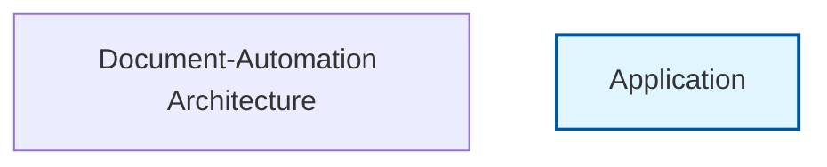

# Document-Automation Project Documentation

A comprehensive documentation automation tool for analyzing codebases and generating professional documentation across multiple formats.

## Table of Contents

- [Overview](#overview)
- [Features](#features)
- [Architecture](#architecture)
- [Prerequisites](#prerequisites)
- [Installation](#installation)
- [Configuration](#configuration)
- [Usage](#usage)
- [API Reference](#api-reference)
- [Project Structure](#project-structure)
- [How It Works](#how-it-works)
- [Deployment](#deployment)
- [Contributing](#contributing)
- [Troubleshooting](#troubleshooting)
- [License](#license)

## Overview

Document-Automation is a powerful Python-based tool designed to automatically analyze codebases and generate comprehensive documentation. It provides intelligent codebase analysis, multiple output formats, and professional-grade documentation generation capabilities.

### Why Use Document-Automation?

- **Comprehensive Analysis**: Deep codebase inspection with AST parsing
- **Multiple Formats**: Generate HTML, PDF, Markdown, and interactive documentation
- **Professional Quality**: Enterprise-ready documentation with modern themes
- **Automated Workflows**: Reduce manual documentation overhead
- **Framework Detection**: Intelligent technology stack analysis
- **Database Integration**: Schema analysis and ER diagram generation

## Features

### Core Capabilities
- **Codebase Analysis**: Complete project structure analysis with metrics
- **AST Parsing**: Deep code analysis for Python and JavaScript
- **Framework Detection**: Automatic technology stack identification
- **Database Schema Analysis**: SQL schema extraction and visualization
- **Security Analysis**: Code security assessment and recommendations
- **Interactive Documentation**: Modern, searchable documentation interfaces

### Output Formats
- Interactive HTML with search and navigation
- Professional PDF reports
- Markdown documentation
- Confluence-ready content
- JSON data exports
- LaTeX and academic formats

### Advanced Features
- **Mermaid Diagrams**: Architecture and database relationship diagrams
- **Multi-language Support**: Internationalization capabilities
- **Custom Themes**: Modern, dark, corporate, and minimal themes
- **Accessibility Compliance**: WCAG 2.1 AA compliant output
- **Responsive Design**: Mobile-friendly documentation
- **Background Processing**: Handle large codebases efficiently

## Architecture



### System Components

#### 1. Analyzers Module (`src/analyzers/`)
- **BaseAnalyzer**: Core analysis functionality
- **CodebaseAnalyzer**: Project structure and file analysis
- **DatabaseAnalyzer**: SQL schema and relationship analysis
- **FrameworkDetector**: Technology stack identification

#### 2. Parsers Module (`src/parsers/`)
- **ASTAnalyzer**: Abstract syntax tree parsing
- **PythonParser**: Python-specific code analysis
- **JavaScriptParser**: JavaScript code analysis
- **ParserFactory**: Language-agnostic parser selection

#### 3. Generators Module (`src/generators/`)
- **DocumentationGenerator**: Core documentation generation
- **InteractiveDocGenerator**: Interactive HTML generation
- **ProfessionalDocGenerator**: Enterprise-grade documentation

#### 4. Diagrams Module (`src/diagrams/`)
- **ArchitectureDiagrams**: System architecture visualization
- **DatabaseDiagrams**: ER diagrams and schema visualization
- **MermaidGenerator**: Mermaid diagram generation

#### 5. Export Module (`src/export/`)
- **FormatExporter**: Multi-format output generation

## Prerequisites

### System Requirements
- Python 3.8 or higher
- Node.js 14+ (for JavaScript analysis)
- Git (for repository analysis)
- 4GB+ RAM for large codebases
- 1GB+ disk space

### Required Dependencies
```bash
# Core dependencies
fastapi>=0.68.0
uvicorn[standard]>=0.15.0
pydantic>=1.8.0
sqlalchemy>=1.4.0
requests>=2.25.0

# Analysis libraries
tree-sitter>=0.20.0
tree-sitter-python>=0.20.0
tree-sitter-javascript>=0.20.0
gitpython>=3.1.0

# Documentation generation
jinja2>=3.0.0
markdown>=3.3.0
weasyprint>=54.0
matplotlib>=3.3.0
plotly>=5.0.0
mermaid-py>=0.3.0

# Optional dependencies
redis>=4.0.0  # For caching
celery>=5.2.0  # For background processing
```

## Installation

### Method 1: pip Installation (Recommended)
```bash
# Install from PyPI (when available)
pip install document-automation

# Or install from source
git clone https://github.com/vedantparmar12/Document-Automation.git
cd Document-Automation
pip install -r requirements.txt
```

### Method 2: Docker Installation
```bash
# Pull the Docker image
docker pull vedantparmar12/document-automation:latest

# Run with volume mounting
docker run -v /path/to/your/project:/app/input \
           -v /path/to/output:/app/output \
           vedantparmar12/document-automation:latest
```

### Method 3: Development Setup
```bash
# Clone repository
git clone https://github.com/vedantparmar12/Document-Automation.git
cd Document-Automation

# Create virtual environment
python -m venv venv
source venv/bin/activate  # On Windows: venv\Scripts\activate

# Install dependencies
pip install -r requirements.txt

# Run development server
python run_server.py
```

## Configuration

### Basic Configuration
Create a `config.toml` file in your project root:

```toml
[general]
name = "Document-Automation"
version = "1.0.0"
description = "Automated documentation generation tool"

[analysis]
max_files = 1000
include_ast = true
include_database = true
include_security = true

[output]
format = "interactive"
theme = "modern"
include_diagrams = true
include_search = true

[export]
formats = ["html", "pdf", "markdown"]
output_dir = "./docs"
```

### Environment Variables
```bash
# Optional configuration
export DOC_AUTO_THEME=modern
export DOC_AUTO_OUTPUT_DIR=./documentation
export DOC_AUTO_MAX_FILES=1000
export REDIS_URL=redis://localhost:6379  # For caching
```

## Usage

### Command Line Interface

#### Basic Analysis
```bash
# Analyze current directory
python -m document_automation analyze .

# Analyze specific directory
python -m document_automation analyze /path/to/project

# Analyze GitHub repository
python -m document_automation analyze https://github.com/user/repo.git
```

#### Advanced Options
```bash
# Generate with specific format
python -m document_automation analyze . --format html --theme modern

# Include specific features
python -m document_automation analyze . --ast --database --security

# Export multiple formats
python -m document_automation analyze . --export html,pdf,markdown

# Custom output directory
python -m document_automation analyze . --output ./custom-docs
```

### Python API Usage

```python
from document_automation import DocumentAnalyzer, DocumentGenerator

# Initialize analyzer
analyzer = DocumentAnalyzer()

# Analyze codebase
result = analyzer.analyze_codebase(
    path="./my-project",
    include_ast=True,
    include_database=True,
    include_security=True
)

# Generate documentation
generator = DocumentGenerator()
docs = generator.generate_documentation(
    analysis_result=result,
    format="interactive",
    theme="modern",
    export_formats=["html", "pdf"]
)

print(f"Documentation generated: {docs.output_path}")
```

### Web Interface

Start the web server:
```bash
python run_server.py
```

Access the web interface at `http://localhost:8000` and use the interactive form to:
- Upload project files or provide repository URLs
- Configure analysis options
- Preview generated documentation
- Download in multiple formats

## API Reference

### Core Classes

#### DocumentAnalyzer
Main analysis class for codebase inspection.

```python
class DocumentAnalyzer:
    def analyze_codebase(
        self,
        path: str,
        source_type: str = "local",
        include_ast: bool = True,
        include_database: bool = True,
        include_security: bool = True,
        max_files: int = 1000
    ) -> AnalysisResult
```

#### DocumentGenerator
Documentation generation and formatting.

```python
class DocumentGenerator:
    def generate_documentation(
        self,
        analysis_result: AnalysisResult,
        format: str = "interactive",
        theme: str = "modern",
        export_formats: List[str] = None
    ) -> DocumentationResult
```

#### FormatExporter
Multi-format export functionality.

```python
class FormatExporter:
    def export_documentation(
        self,
        documentation: DocumentationResult,
        formats: List[str],
        output_dir: str = "./docs"
    ) -> ExportResult
```

### REST API Endpoints

When running the web server (`python run_server.py`):

#### POST /analyze
Analyze a codebase and generate documentation.

```bash
curl -X POST "http://localhost:8000/analyze" \
  -H "Content-Type: application/json" \
  -d '{
    "path": "./my-project",
    "source_type": "local",
    "include_ast": true,
    "include_database": true,
    "format": "interactive",
    "theme": "modern"
  }'
```

#### GET /analysis/{analysis_id}
Retrieve analysis results by ID.

```bash
curl "http://localhost:8000/analysis/analysis_20240101_120000_1234"
```

#### POST /export
Export documentation in specific formats.

```bash
curl -X POST "http://localhost:8000/export" \
  -H "Content-Type: application/json" \
  -d '{
    "analysis_id": "analysis_20240101_120000_1234",
    "formats": ["html", "pdf"],
    "theme": "modern"
  }'
```

## Project Structure

```
Document-Automation/
├── src/
│   ├── analyzers/          # Code analysis modules
│   │   ├── base_analyzer.py
│   │   ├── codebase_analyzer.py
│   │   ├── database_analyzer.py
│   │   └── framework_detector.py
│   ├── parsers/           # Language-specific parsers
│   │   ├── ast_analyzer.py
│   │   ├── python_parser.py
│   │   ├── javascript_parser.py
│   │   └── parser_factory.py
│   ├── generators/        # Documentation generators
│   │   ├── documentation_generator.py
│   │   ├── interactive_doc_generator.py
│   │   └── professional_doc_generator.py
│   ├── diagrams/         # Diagram generation
│   │   ├── architecture_diagrams.py
│   │   ├── database_diagrams.py
│   │   └── mermaid_generator.py
│   ├── export/           # Format exporters
│   │   └── format_exporter.py
│   ├── pagination/       # Large codebase handling
│   │   ├── chunker.py
│   │   ├── context.py
│   │   └── strategies.py
│   ├── processing/       # Background processing
│   │   ├── background_processor.py
│   │   └── concurrent_analyzer.py
│   ├── security/         # Security analysis
│   │   └── validation.py
│   ├── tools/           # MCP tools integration
│   │   └── consolidated_documentation_tools.py
│   ├── schemas.py       # Pydantic models
│   └── server.py        # FastAPI web server
├── docs/               # Generated documentation
├── requirements.txt    # Python dependencies
├── pyproject.toml     # Python project configuration
├── package.json       # Node.js dependencies
├── tsconfig.json      # TypeScript configuration
├── wrangler.toml      # Cloudflare Workers config
├── run_server.py      # Development server
└── README.md          # Project documentation
```

## How It Works

### Analysis Pipeline

1. **Input Processing**: Accepts local directories, GitHub URLs, or uploaded files
2. **Structure Analysis**: Scans project structure and identifies file types
3. **Framework Detection**: Analyzes dependencies and configuration files
4. **Code Parsing**: Performs AST analysis for supported languages
5. **Database Analysis**: Extracts schema information from various sources
6. **Security Scanning**: Identifies potential security issues
7. **Metrics Calculation**: Computes complexity and quality metrics

### Documentation Generation

1. **Template Selection**: Chooses appropriate template based on format and theme
2. **Content Assembly**: Combines analysis results with templates
3. **Diagram Generation**: Creates Mermaid diagrams for architecture and data flow
4. **Format Rendering**: Generates output in requested formats
5. **Post-processing**: Applies themes, optimization, and accessibility features

### Technology Stack

#### Core Technologies
- **FastAPI**: Modern web framework for APIs
- **Pydantic**: Data validation and settings management
- **SQLAlchemy**: Database ORM and schema analysis
- **Jinja2**: Template engine for documentation generation
- **Tree-sitter**: Language-agnostic code parsing

#### Analysis Libraries
- **GitPython**: Git repository analysis
- **ast**: Python abstract syntax tree parsing
- **Pandas**: Data analysis and metrics calculation
- **Plotly**: Interactive chart generation
- **Matplotlib/Seaborn**: Statistical visualization

#### Documentation Tools
- **WeasyPrint**: PDF generation from HTML
- **Markdown**: Lightweight markup processing
- **MkDocs**: Documentation site generation
- **Mermaid**: Diagram generation
- **Sphinx**: Advanced documentation features

## Deployment

### Production Deployment

#### Docker Deployment
```bash
# Build image
docker build -t document-automation .

# Run with environment variables
docker run -d \
  -p 8000:8000 \
  -e DOC_AUTO_THEME=corporate \
  -e REDIS_URL=redis://redis:6379 \
  -v /path/to/projects:/app/input \
  -v /path/to/output:/app/output \
  document-automation
```

#### Cloud Deployment (Heroku)
```bash
# Install Heroku CLI and login
heroku login

# Create application
heroku create my-doc-automation

# Configure environment variables
heroku config:set DOC_AUTO_THEME=modern
heroku config:set DOC_AUTO_MAX_FILES=5000

# Deploy
git push heroku main
```

#### Serverless (Cloudflare Workers)
```bash
# Configure wrangler.toml
npm install -g wrangler
wrangler publish
```

### Performance Optimization

#### Caching Configuration
```python
# Redis caching for large analyses
REDIS_CONFIG = {
    'host': 'localhost',
    'port': 6379,
    'db': 0,
    'decode_responses': True
}

# Cache analysis results for 24 hours
CACHE_DURATION = 86400
```

#### Background Processing
```python
# Celery configuration for large codebases
CELERY_CONFIG = {
    'broker_url': 'redis://localhost:6379/0',
    'result_backend': 'redis://localhost:6379/0',
    'task_serializer': 'json',
    'accept_content': ['json'],
    'result_serializer': 'json',
}
```

## Contributing

### Development Setup
```bash
# Fork repository and clone
git clone https://github.com/YOUR_USERNAME/Document-Automation.git
cd Document-Automation

# Create development branch
git checkout -b feature/new-feature

# Install development dependencies
pip install -r requirements-dev.txt
pip install -e .

# Run tests
pytest tests/

# Run linting
flake8 src/
black src/
isort src/
```

### Code Style Guidelines
- Follow PEP 8 for Python code
- Use type hints for all functions
- Write comprehensive docstrings
- Maintain test coverage above 80%
- Use meaningful variable and function names

### Testing Framework
```bash
# Run all tests
pytest

# Run with coverage
pytest --cov=src tests/

# Run specific test categories
pytest tests/analyzers/
pytest tests/generators/
pytest tests/integration/
```

## Troubleshooting

### Common Issues

#### Installation Problems
```bash
# Issue: Tree-sitter compilation fails
# Solution: Install build tools
# Windows:
pip install wheel setuptools
# Linux/Mac:
sudo apt-get install build-essential  # Ubuntu/Debian
brew install gcc  # macOS
```

#### Memory Issues
```bash
# Issue: Out of memory for large codebases
# Solution: Reduce max_files or enable pagination
python -m document_automation analyze . --max-files 500 --paginate
```

#### Permission Errors
```bash
# Issue: Cannot write to output directory
# Solution: Check permissions and create directory
mkdir -p ./docs
chmod 755 ./docs
```

### Performance Issues

#### Large Codebase Analysis
```python
# Use background processing for large projects
analyzer = DocumentAnalyzer(
    max_files=10000,
    use_background_processing=True,
    chunk_size=100
)
```

#### Memory Optimization
```python
# Enable streaming for large analyses
generator = DocumentGenerator(
    streaming_mode=True,
    max_memory_mb=2048
)
```

### Error Codes

| Code | Description | Solution |
|------|-------------|----------|
| E001 | Path not found | Check file path exists |
| E002 | Permission denied | Check file permissions |
| E003 | Unsupported format | Use supported output format |
| E004 | Memory limit exceeded | Reduce max_files or enable pagination |
| E005 | Network timeout | Check internet connection for GitHub repos |

## License

This project is licensed under the MIT License - see the [LICENSE](LICENSE) file for details.

### Dependencies

This project uses various open-source libraries. See [requirements.txt](requirements.txt) for a complete list of dependencies and their licenses.

### Attribution

- Tree-sitter for language parsing
- Mermaid for diagram generation  
- FastAPI for web framework
- WeasyPrint for PDF generation

---

**Document-Automation** - Making documentation effortless through intelligent automation.

For more information, visit our [GitHub repository](https://github.com/vedantparmar12/Document-Automation) or [documentation site](https://vedantparmar12.github.io/Document-Automation/).
