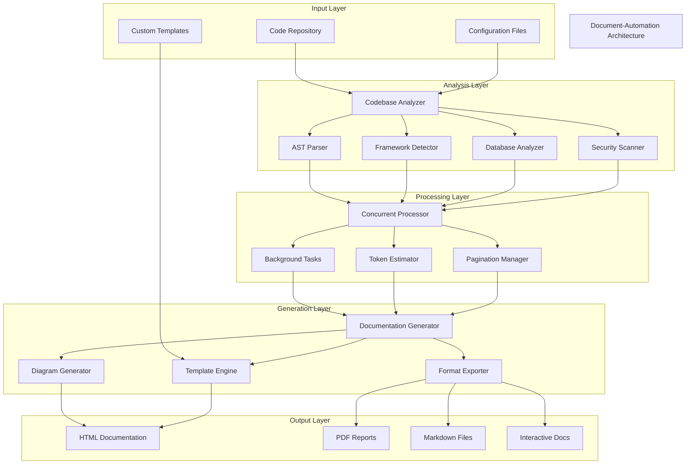

# Document Automation - Comprehensive Documentation

A powerful Python-based documentation automation tool that analyzes codebases and generates comprehensive documentation with multiple export formats.

## Table of Contents

- [Overview](#overview)
- [Features](#features)
- [Architecture](#architecture)
- [Prerequisites](#prerequisites)
- [Installation](#installation)
- [Configuration](#configuration)
- [Usage](#usage)
- [API Reference](#api-reference)
- [Project Structure](#project-structure)
- [How It Works](#how-it-works)
- [Deployment](#deployment)
- [Contributing](#contributing)
- [Troubleshooting](#troubleshooting)
- [License](#license)

## Overview

Document Automation is an advanced documentation generation tool designed to analyze codebases and automatically create comprehensive, professional documentation. Built with Python and leveraging modern technologies like FastAPI, AST parsing, and multiple export formats, this tool streamlines the documentation process for developers and teams.

### Why Use Document Automation?

- **Automated Analysis**: Automatically analyzes your codebase structure, dependencies, and architecture
- **Multiple Formats**: Export to HTML, PDF, Markdown, DOCX, and more
- **Interactive Documentation**: Generate searchable, navigable documentation
- **Framework Detection**: Automatically detects and documents frameworks and technologies
- **Database Schema Analysis**: Analyzes and documents database structures
- **Security Analysis**: Identifies potential security issues
- **Mermaid Diagrams**: Auto-generates architecture and flow diagrams

## Features

### Core Features
- 🔍 **Comprehensive Codebase Analysis**: AST parsing, dependency analysis, and framework detection
- 📊 **Multiple Export Formats**: HTML, PDF, Markdown, DOCX, Confluence, Notion
- 🎨 **Professional Themes**: Modern, minimal, dark, corporate, and custom themes
- 🔒 **Security Analysis**: Built-in security scanning and vulnerability detection
- 📈 **Interactive Diagrams**: Auto-generated Mermaid diagrams for architecture visualization
- 🌐 **Multi-language Support**: Supports Python, JavaScript, and more
- 📱 **Responsive Design**: Mobile-friendly documentation output
- 🔍 **Search Functionality**: Full-text search in generated documentation
- ♿ **Accessibility Compliance**: WCAG 2.1 AA compliant outputs

### Advanced Features
- **Concurrent Processing**: Multi-threaded analysis for large codebases
- **Pagination Support**: Handle large repositories with smart pagination
- **Background Processing**: Async processing for improved performance
- **Custom CSS Support**: Inject custom styles for branding
- **API Endpoint Discovery**: Automatically documents REST APIs
- **Database Schema Visualization**: ER diagrams and relationship mapping

## Architecture

### System Architecture



### Component Overview

#### Analyzers
- **BaseAnalyzer**: Core analysis functionality
- **CodebaseAnalyzer**: Repository structure analysis
- **DatabaseAnalyzer**: Database schema analysis
- **FrameworkDetector**: Technology stack detection

#### Parsers
- **ASTAnalyzer**: Abstract Syntax Tree parsing
- **PythonParser**: Python-specific parsing
- **JavaScriptParser**: JavaScript-specific parsing
- **BaseParser**: Generic parsing functionality

#### Generators
- **DocumentationGenerator**: Core documentation generation
- **InteractiveDocGenerator**: Interactive HTML generation
- **ProfessionalDocGenerator**: Professional format generation

#### Export & Processing
- **FormatExporter**: Multi-format export capability
- **ConcurrentAnalyzer**: Parallel processing
- **BackgroundProcessor**: Async task management

## Prerequisites

### System Requirements
- Python 3.8 or higher
- Git (for repository analysis)
- 4GB RAM minimum (8GB recommended for large projects)
- 1GB free disk space

### Required Dependencies

```python
# Core Dependencies
fastapi>=0.104.1
uvicorn[standard]>=0.24.0
pydantic>=2.5.0
starlette>=0.27.0

# Analysis & Parsing
tree-sitter>=0.20.4
tree-sitter-python>=0.20.4
tree-sitter-javascript>=0.20.3
gitpython>=3.1.40

# Documentation Generation
mkdocs>=1.5.3
markdown-it-py>=3.0.0
jinja2>=3.1.2
markdown>=3.5.1

# Export Formats
reportlab>=4.0.7
weasyprint>=60.2
python-docx>=1.1.0
openpyxl>=3.1.2

# Visualization
matplotlib>=3.8.2
plotly>=5.17.0
mermaid-py>=0.3.0

# Processing
pandas>=2.1.4
numpy>=1.24.4
sqlalchemy>=2.0.23
celery>=5.3.4
redis>=5.0.1
```

## Installation

### Method 1: Clone and Install

```bash
# Clone the repository
git clone https://github.com/vedantparmar12/Document-Automation.git
cd Document-Automation

# Create virtual environment
python -m venv venv

# Activate virtual environment
# On Windows:
venv\Scripts\activate
# On macOS/Linux:
source venv/bin/activate

# Install dependencies
pip install -r requirements.txt
```

### Method 2: Using pip (when published)

```bash
pip install document-automation
```

### Method 3: Development Setup

```bash
# Clone and setup for development
git clone https://github.com/vedantparmar12/Document-Automation.git
cd Document-Automation

# Install in development mode
pip install -e .

# Install development dependencies
pip install -r requirements-dev.txt
```

## Configuration

### Environment Variables

Create a `.env` file in the project root:

```env
# Server Configuration
HOST=0.0.0.0
PORT=8000
DEBUG=True
WORKERS=4

# Processing Configuration
MAX_CONCURRENT_ANALYSES=3
DEFAULT_TIMEOUT=300
MAX_FILE_SIZE=10MB

# Export Configuration
DEFAULT_THEME=modern
DEFAULT_FORMAT=interactive
ENABLE_PDF_EXPORT=True
ENABLE_SEARCH=True

# Security Configuration
VALIDATE_PATHS=True
SANDBOX_MODE=False
MAX_ANALYSIS_TIME=3600

# External Services (Optional)
REDIS_URL=redis://localhost:6379
DATABASE_URL=sqlite:///./analysis.db
```

### Configuration File

Create `config.yaml`:

```yaml
analysis:
  max_files: 1000
  include_patterns:
    - "*.py"
    - "*.js"
    - "*.ts"
    - "*.jsx"
    - "*.tsx"
    - "*.sql"
  exclude_patterns:
    - "node_modules"
    - "__pycache__"
    - ".git"
    - "*.pyc"
    - "dist"
    - "build"

documentation:
  title: "Auto-Generated Documentation"
  author: "Document Automation"
  version: "1.0.0"
  theme: "modern"
  include_toc: true
  include_search: true
  include_diagrams: true

export:
  formats:
    - html
    - pdf
    - markdown
  output_dir: "./docs"
  responsive_design: true
  accessibility_compliance: true

security:
  validate_inputs: true
  sanitize_paths: true
  max_analysis_depth: 10
  allowed_extensions:
    - .py
    - .js
    - .ts
    - .md
    - .sql
```

## Usage

### Command Line Interface

```bash
# Basic usage
python -m document_automation analyze /path/to/project

# With custom output format
python -m document_automation analyze /path/to/project --format html --theme modern

# Multiple formats
python -m document_automation analyze /path/to/project --formats html,pdf,markdown

# With custom configuration
python -m document_automation analyze /path/to/project --config config.yaml

# GitHub repository analysis
python -m document_automation analyze-repo https://github.com/user/repo

# Server mode
python -m document_automation serve --host 0.0.0.0 --port 8000
```

### Web Server

```bash
# Start the web server
python run_server.py

# Or using uvicorn directly
uvicorn src.server:app --host 0.0.0.0 --port 8000 --reload
```

### Python API Usage

```python
from src.analyzers import CodebaseAnalyzer
from src.generators import DocumentationGenerator
from src.export import FormatExporter

# Initialize components
analyzer = CodebaseAnalyzer()
generator = DocumentationGenerator()
exporter = FormatExporter()

# Analyze codebase
analysis_result = analyzer.analyze_repository("/path/to/project")

# Generate documentation
documentation = generator.generate(
    analysis_result,
    theme="modern",
    include_diagrams=True
)

# Export to multiple formats
exporter.export_multiple(
    documentation,
    formats=["html", "pdf", "markdown"],
    output_dir="./docs"
)
```

### REST API Usage

```python
import requests

# Start analysis
response = requests.post("http://localhost:8000/analyze", json={
    "path": "/path/to/project",
    "include_ast_analysis": True,
    "include_security_analysis": True,
    "formats": ["html", "pdf"]
})

analysis_id = response.json()["analysis_id"]

# Check status
status = requests.get(f"http://localhost:8000/status/{analysis_id}")

# Download results
docs = requests.get(f"http://localhost:8000/download/{analysis_id}")
```

## API Reference

### Core Classes

#### CodebaseAnalyzer

```python
class CodebaseAnalyzer:
    """Main analyzer for codebase analysis."""
    
    def analyze_repository(self, path: str, **options) -> AnalysisResult:
        """Analyze a repository and return structured results."""
        
    def analyze_files(self, files: List[str], **options) -> AnalysisResult:
        """Analyze specific files."""
        
    def get_metrics(self, analysis: AnalysisResult) -> Dict:
        """Extract metrics from analysis results."""
```

#### DocumentationGenerator

```python
class DocumentationGenerator:
    """Generate documentation from analysis results."""
    
    def generate(self, analysis: AnalysisResult, **options) -> Documentation:
        """Generate documentation in specified format."""
        
    def generate_interactive(self, analysis: AnalysisResult) -> str:
        """Generate interactive HTML documentation."""
        
    def generate_api_docs(self, analysis: AnalysisResult) -> str:
        """Generate API documentation."""
```

#### FormatExporter

```python
class FormatExporter:
    """Export documentation to various formats."""
    
    def export_html(self, content: str, output_path: str) -> bool:
        """Export to HTML format."""
        
    def export_pdf(self, content: str, output_path: str) -> bool:
        """Export to PDF format."""
        
    def export_multiple(self, content: str, formats: List[str], output_dir: str) -> Dict:
        """Export to multiple formats simultaneously."""
```

### REST API Endpoints

#### Analysis Endpoints

```http
POST /analyze
Content-Type: application/json

{
    "path": "/path/to/project",
    "source_type": "local",
    "include_ast_analysis": true,
    "include_security_analysis": true,
    "include_diagrams": true,
    "formats": ["html", "pdf"],
    "theme": "modern"
}
```

```http
GET /status/{analysis_id}
Response: {
    "status": "completed",
    "progress": 100,
    "results_available": true,
    "error": null
}
```

```http
GET /download/{analysis_id}
Response: Binary content or redirect to download URL
```

#### Repository Analysis

```http
POST /analyze-repo
Content-Type: application/json

{
    "repo_url": "https://github.com/user/repo",
    "branch": "main",
    "include_ast_analysis": true,
    "formats": ["html", "markdown"]
}
```

## Project Structure

```
Document-Automation/
│
├── src/                          # Source code
│   ├── __init__.py
│   ├── server.py                 # FastAPI server
│   ├── schemas.py                # Pydantic models
│   │
│   ├── analyzers/                # Analysis components
│   │   ├── __init__.py
│   │   ├── base_analyzer.py      # Base analysis class
│   │   ├── codebase_analyzer.py  # Main codebase analyzer
│   │   ├── database_analyzer.py  # Database schema analysis
│   │   └── framework_detector.py # Framework detection
│   │
│   ├── parsers/                  # Code parsers
│   │   ├── __init__.py
│   │   ├── base_parser.py        # Base parser class
│   │   ├── ast_analyzer.py       # AST analysis
│   │   ├── python_parser.py      # Python-specific parsing
│   │   ├── javascript_parser.py  # JavaScript parsing
│   │   └── parser_factory.py     # Parser factory
│   │
│   ├── generators/               # Documentation generators
│   │   ├── __init__.py
│   │   ├── documentation_generator.py
│   │   ├── interactive_doc_generator.py
│   │   └── professional_doc_generator.py
│   │
│   ├── export/                   # Export functionality
│   │   └── format_exporter.py
│   │
│   ├── diagrams/                 # Diagram generation
│   │   ├── __init__.py
│   │   ├── mermaid_generator.py
│   │   ├── architecture_diagrams.py
│   │   └── database_diagrams.py
│   │
│   ├── processing/               # Processing utilities
│   │   ├── __init__.py
│   │   ├── concurrent_analyzer.py
│   │   └── background_processor.py
│   │
│   ├── pagination/               # Pagination handling
│   │   ├── __init__.py
│   │   ├── chunker.py
│   │   ├── strategies.py
│   │   ├── context.py
│   │   └── token_estimator.py
│   │
│   ├── security/                 # Security validation
│   │   ├── __init__.py
│   │   └── validation.py
│   │
│   └── tools/                    # Consolidated tools
│       ├── __init__.py
│       └── consolidated_documentation_tools.py
│
├── docs/                         # Generated documentation
├── tests/                        # Test files
├── templates/                    # Documentation templates
├── static/                       # Static assets
├── requirements.txt              # Dependencies
├── pyproject.toml               # Project configuration
├── package.json                 # Node.js dependencies (if any)
├── tsconfig.json                # TypeScript configuration
├── wrangler.toml                # Cloudflare Workers config
├── run_server.py                # Server runner
└── README.md                    # Project README
```

## How It Works

### Analysis Process

1. **Repository Scanning**: Recursively scans the target directory
2. **File Type Detection**: Identifies file types and programming languages
3. **AST Parsing**: Parses source code into Abstract Syntax Trees
4. **Framework Detection**: Identifies frameworks and libraries used
5. **Dependency Analysis**: Maps dependencies and their relationships
6. **Security Scanning**: Identifies potential security issues
7. **Metric Calculation**: Computes code metrics and complexity scores

### Documentation Generation

1. **Template Selection**: Chooses appropriate template based on theme
2. **Content Assembly**: Assembles analyzed data into documentation structure
3. **Diagram Generation**: Creates Mermaid diagrams for visualization
4. **Format Rendering**: Renders content in requested formats
5. **Export Processing**: Optimizes and exports final documentation

### Supported Analysis Types

- **Static Code Analysis**: Function/class/variable analysis
- **Dependency Mapping**: Import/export relationships
- **Architecture Analysis**: High-level system architecture
- **Database Schema**: Table relationships and structures
- **API Discovery**: REST endpoint identification
- **Security Scanning**: Common vulnerability detection

## Deployment

### Docker Deployment

```dockerfile
FROM python:3.11-slim

WORKDIR /app

COPY requirements.txt .
RUN pip install --no-cache-dir -r requirements.txt

COPY . .

EXPOSE 8000

CMD ["uvicorn", "src.server:app", "--host", "0.0.0.0", "--port", "8000"]
```

```bash
# Build and run
docker build -t document-automation .
docker run -p 8000:8000 document-automation
```

### Cloud Deployment

#### AWS EC2

```bash
# Install on EC2 instance
sudo yum update -y
sudo yum install python3 python3-pip git -y

# Clone and setup
git clone https://github.com/vedantparmar12/Document-Automation.git
cd Document-Automation
pip3 install -r requirements.txt

# Run with systemd
sudo nano /etc/systemd/system/document-automation.service
sudo systemctl enable document-automation
sudo systemctl start document-automation
```

#### Heroku

```bash
# Heroku deployment
heroku create your-app-name
heroku buildpacks:set heroku/python
git push heroku main
```

#### Cloudflare Workers

The project includes `wrangler.toml` for Cloudflare Workers deployment:

```bash
npm install -g @cloudflare/wrangler
wrangler publish
```

## Contributing

We welcome contributions! Here's how to get started:

### Development Setup

```bash
# Fork and clone the repository
git clone https://github.com/your-username/Document-Automation.git
cd Document-Automation

# Create feature branch
git checkout -b feature/your-feature-name

# Setup development environment
python -m venv venv
source venv/bin/activate  # On Windows: venv\Scripts\activate
pip install -r requirements-dev.txt

# Install pre-commit hooks
pre-commit install
```

### Running Tests

```bash
# Run all tests
python -m pytest

# Run with coverage
python -m pytest --cov=src

# Run specific test file
python -m pytest tests/test_analyzer.py

# Run with verbose output
python -m pytest -v
```

### Code Style

We use:
- **Black** for code formatting
- **isort** for import sorting  
- **flake8** for linting
- **mypy** for type checking

```bash
# Format code
black src/ tests/
isort src/ tests/

# Check linting
flake8 src/ tests/

# Type checking
mypy src/
```

### Contribution Guidelines

1. **Fork the repository** and create a feature branch
2. **Write tests** for new functionality
3. **Follow code style** guidelines
4. **Update documentation** as needed
5. **Submit a pull request** with clear description

### Reporting Issues

When reporting issues, please include:
- Python version and OS
- Error messages and stack traces
- Minimal reproducible example
- Expected vs actual behavior

## Troubleshooting

### Common Issues

#### Analysis Fails with Large Repositories

```bash
# Increase memory limits
export PYTHONHASHSEED=0
export PYTHONMAXMEMORY=8GB

# Use pagination
python -m document_automation analyze /path/to/project --max-files 500
```

#### PDF Export Issues

```bash
# Install additional dependencies
# On Ubuntu/Debian:
sudo apt-get install wkhtmltopdf

# On macOS:
brew install wkhtmltopdf

# On Windows: Download from https://wkhtmltopdf.org/
```

#### Permission Errors

```bash
# Ensure proper permissions
chmod +x run_server.py

# Run with proper user permissions
sudo chown -R $(whoami):$(whoami) ./docs/
```

### Performance Optimization

#### For Large Codebases

```python
# Optimize analysis settings
analyzer = CodebaseAnalyzer(
    max_concurrent_files=10,
    enable_caching=True,
    skip_binary_files=True,
    max_file_size="10MB"
)
```

#### Memory Usage

```python
# Reduce memory footprint
import gc

# Enable garbage collection
gc.enable()

# Use streaming for large files
analyzer.enable_streaming = True
analyzer.chunk_size = 1024
```

### Debug Mode

```bash
# Enable debug logging
export DEBUG=True
export LOG_LEVEL=DEBUG

# Run with verbose output
python -m document_automation analyze /path/to/project --verbose --debug
```

## License

This project is licensed under the MIT License. See the [LICENSE](LICENSE) file for details.

```
MIT License

Copyright (c) 2024 Vedant Parmar

Permission is hereby granted, free of charge, to any person obtaining a copy
of this software and associated documentation files (the "Software"), to deal
in the Software without restriction, including without limitation the rights
to use, copy, modify, merge, publish, distribute, sublicense, and/or sell
copies of the Software, and to permit persons to whom the Software is
furnished to do so, subject to the following conditions:

The above copyright notice and this permission notice shall be included in all
copies or substantial portions of the Software.

THE SOFTWARE IS PROVIDED "AS IS", WITHOUT WARRANTY OF ANY KIND, EXPRESS OR
IMPLIED, INCLUDING BUT NOT LIMITED TO THE WARRANTIES OF MERCHANTABILITY,
FITNESS FOR A PARTICULAR PURPOSE AND NONINFRINGEMENT. IN NO EVENT SHALL THE
AUTHORS OR COPYRIGHT HOLDERS BE LIABLE FOR ANY CLAIM, DAMAGES OR OTHER
LIABILITY, WHETHER IN AN ACTION OF CONTRACT, TORT OR OTHERWISE, ARISING FROM,
OUT OF OR IN CONNECTION WITH THE SOFTWARE OR THE USE OR OTHER DEALINGS IN THE
SOFTWARE.
```

---

## Quick Start Summary

1. **Clone the repository**: `git clone https://github.com/vedantparmar12/Document-Automation.git`
2. **Install dependencies**: `pip install -r requirements.txt`
3. **Start the server**: `python run_server.py`
4. **Access the API**: Navigate to `http://localhost:8000`
5. **Analyze your project**: Use the web interface or REST API
6. **Download documentation**: Get your generated docs in multiple formats

For more detailed information, please refer to the specific sections above or check the project's GitHub repository.

---

*Generated by Document Automation v1.0.0 - Automated documentation generation tool*
