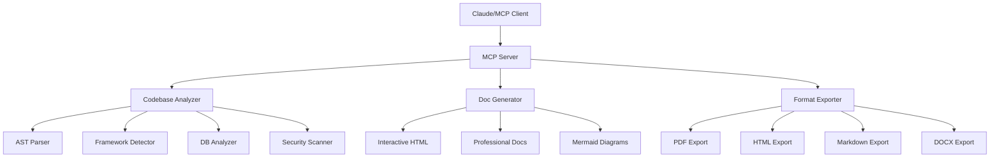
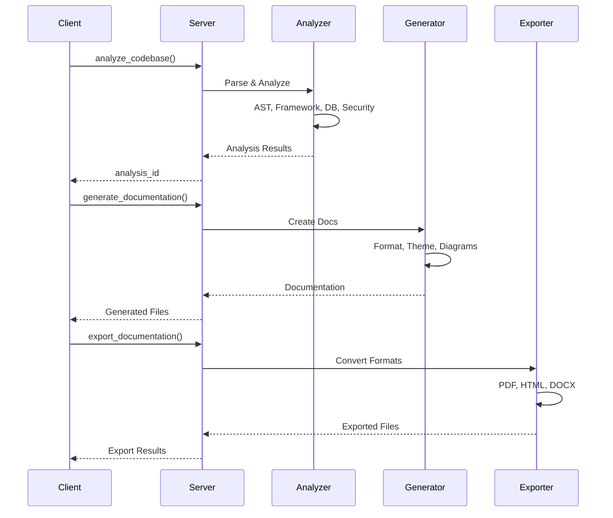

# 📚 Document Automation MCP Server

[](https://www.python.org/downloads/)
[](https://modelcontextprotocol.io)
[](LICENSE)
[](https://github.com/psf/black)

A powerful Model Context Protocol (MCP) server that provides intelligent codebase analysis, comprehensive documentation generation, and multi-format export capabilities. Built for seamless integration with Claude and other AI assistants.

---

## ✨ Features

### 🔍 **Intelligent Codebase Analysis**
- **AST Parsing**: Deep analysis of Python and JavaScript code structures
- **Framework Detection**: Automatically identifies frameworks (React, Flask, Django, FastAPI, etc.)
- **Database Schema Analysis**: Extracts and visualizes database relationships
- **API Endpoint Discovery**: Maps REST endpoints with methods and parameters
- **Security Scanning**: Identifies potential vulnerabilities and best practices
- **Dependency Tracking**: Analyzes project dependencies and versions

### 📝 **Professional Documentation Generation**
- **Multiple Formats**: Markdown, HTML, PDF, DOCX, Confluence, Notion, JSON, EPUB
- **Interactive Documentation**: Search, navigation, syntax highlighting
- **Mermaid Diagrams**: Architecture, database ER, API flows, dependency graphs
- **Multi-language Support**: Built-in internationalization
- **Custom Themes**: Modern, minimal, dark, corporate, and more
- **Accessibility Compliant**: WCAG 2.1 AA standards

### 🚀 **Advanced Capabilities**
- **Pagination Support**: Handles large repositories efficiently
- **Background Processing**: Async analysis for better performance
- **Smart Chunking**: Token-aware content splitting
- **Concurrent Analysis**: Parallel file processing
- **Export Automation**: Batch export to multiple formats
- **Archive Generation**: ZIP, TAR, TAR.GZ support

---

## 📋 Table of Contents

- [Installation](#-installation)
- [Quick Start](#-quick-start)
- [Configuration](#-configuration)
- [Usage Examples](#-usage-examples)
- [API Reference](#-api-reference)
- [Project Structure](#-project-structure)
- [Architecture](#-architecture)
- [Development](#-development)
- [Contributing](#-contributing)
- [License](#-license)

---

## 🚀 Installation

### Prerequisites

- Python 3.8 or higher
- Git
- Claude Desktop or MCP-compatible client

### Using pip

```bash
# Clone the repository
git clone https://github.com/vedantparmar12/Document-Automation.git
cd Document-Automation

# Install dependencies
pip install -r requirements.txt
```

### Using uv (Recommended)

```bash
# Install uv (if not already installed)
pip install uv

# Install dependencies with uv
uv pip install -r requirements.txt
```

---

## 🎯 Quick Start

### 1. Configure Claude Desktop

Add the following to your Claude Desktop configuration file:

**Windows**: `%APPDATA%\Claude\claude_desktop_config.json`  
**macOS**: `~/Library/Application Support/Claude/claude_desktop_config.json`

```json
{
  "mcpServers": {
    "document-automation": {
      "command": "python",
      "args": [
        "C:\\path\\to\\Document-Automation\\run_server.py"
      ]
    }
  }
}
```

### 2. Start the Server

```bash
# Using Python directly
python run_server.py

# Or using uv
uv run python run_server.py
```

### 3. Use in Claude

Once configured, Claude can analyze codebases and generate documentation:

```
Analyze this repository: https://github.com/username/repo
Generate comprehensive documentation in HTML format
```

---

## ⚙️ Configuration

### Environment Variables

Create a `.env` file in the project root:

```env
# Analysis Settings
MAX_FILES=1000
MAX_TOKENS_PER_CHUNK=4000
PAGINATION_STRATEGY=auto

# Security Settings
ENABLE_SECURITY_SCAN=true
CONTENT_FILTERING=true

# Export Settings
DEFAULT_OUTPUT_DIR=./docs
DEFAULT_THEME=modern
ENABLE_DIAGRAMS=true
```

### MCP Server Configuration

The server can be configured via `wrangler.toml` for Cloudflare Workers deployment:

```toml
name = "document-automation"
compatibility_date = "2024-01-01"

[env.production]
vars = { ENVIRONMENT = "production" }
```

---

## 📖 Usage Examples

### Analyze a Local Codebase

```python
from src.tools.consolidated_documentation_tools import analyze_codebase

result = analyze_codebase(
    path="/path/to/project",
    source_type="local",
    include_ast_analysis=True,
    include_mermaid_diagrams=True,
    include_security_analysis=True
)

print(f"Analysis ID: {result['analysis_id']}")
print(f"Total Files: {result['metrics']['total_files']}")
print(f"Frameworks: {result['technology_stack']['primary_technologies']}")
```

### Analyze a GitHub Repository

```python
result = analyze_codebase(
    path="https://github.com/username/repo.git",
    source_type="github",
    include_api_endpoints=True,
    include_database_analysis=True
)
```

### Generate Documentation

```python
from src.tools.consolidated_documentation_tools import generate_documentation

docs = generate_documentation(
    analysis_id="analysis_20241212_123456_789",
    format="interactive",
    theme="modern",
    include_toc=True,
    include_search=True,
    auto_export_formats=["pdf", "html", "markdown"]
)

print(f"Documentation generated: {docs['generated_files']}")
```

### Export to Multiple Formats

```python
from src.tools.consolidated_documentation_tools import export_documentation

exports = export_documentation(
    analysis_id="analysis_20241212_123456_789",
    formats=["html", "pdf", "docx", "markdown"],
    theme="corporate",
    include_diagrams=True,
    accessibility_compliance=True,
    archive_formats=["zip"]
)

print(f"Exported {len(exports['exported_files'])} files")
```

---

## 🔌 API Reference

### Core Tools

#### `analyze_codebase`

Comprehensive codebase analysis with built-in features.

**Parameters:**
- `path` (str): Local path or GitHub URL
- `source_type` (str): "local" or "github"
- `include_ast_analysis` (bool): Enable AST parsing
- `include_framework_detection` (bool): Detect frameworks
- `include_database_analysis` (bool): Analyze database schemas
- `include_mermaid_diagrams` (bool): Generate diagrams
- `include_api_endpoints` (bool): Extract API routes
- `include_security_analysis` (bool): Security scanning
- `max_files` (int): Maximum files to analyze (default: 1000)
- `pagination_strategy` (str): "auto", "file_by_file", "chunk_by_chunk", "smart"

**Returns:**
```python
{
    "success": bool,
    "analysis_id": str,
    "comprehensive_analysis": {
        "project_structure": {...},
        "dependencies": [...],
        "api_endpoints": [...],
        "mermaid_diagrams": {...},
        "security_analysis": {...}
    },
    "metrics": {...}
}
```

#### `generate_documentation`

Generate professional documentation with all features built-in.

**Parameters:**
- `analysis_id` (str): ID from previous analysis
- `format` (str): "markdown", "html", "pdf", "interactive", etc.
- `theme` (str): "modern", "minimal", "dark", "corporate", etc.
- `include_toc` (bool): Table of contents
- `include_search` (bool): Search functionality
- `include_navigation` (bool): Navigation sidebar
- `auto_export_formats` (list): Additional export formats

**Returns:**
```python
{
    "success": bool,
    "generated_files": [...],
    "documentation_stats": {...}
}
```

#### `export_documentation`

Export to multiple formats with advanced features.

**Parameters:**
- `analysis_id` (str): ID from previous analysis
- `formats` (list): Export formats
- `theme` (str): Documentation theme
- `accessibility_compliance` (bool): WCAG 2.1 AA compliance
- `archive_formats` (list): Archive types ["zip", "tar", "tar.gz"]

---

## 📁 Project Structure

```
Document-Automation/
├── src/
│   ├── analyzers/           # Codebase analysis modules
│   │   ├── base_analyzer.py
│   │   ├── codebase_analyzer.py
│   │   ├── database_analyzer.py
│   │   ├── framework_detector.py
│   │   └── project_classifier.py
│   ├── diagrams/            # Diagram generation
│   │   ├── architecture_diagrams.py
│   │   ├── database_diagrams.py
│   │   └── mermaid_generator.py
│   ├── export/              # Format exporters
│   │   └── format_exporter.py
│   ├── generators/          # Documentation generators
│   │   ├── documentation_generator.py
│   │   ├── interactive_doc_generator.py
│   │   ├── professional_doc_generator.py
│   │   └── readme_template.py
│   ├── pagination/          # Pagination and chunking
│   │   ├── chunker.py
│   │   ├── context.py
│   │   ├── strategies.py
│   │   └── token_estimator.py
│   ├── parsers/             # Language parsers
│   │   ├── ast_analyzer.py
│   │   ├── javascript_parser.py
│   │   ├── python_parser.py
│   │   └── mcp_analyzer.py
│   ├── processing/          # Background processing
│   │   ├── background_processor.py
│   │   └── concurrent_analyzer.py
│   ├── security/            # Security features
│   │   ├── content_filter.py
│   │   └── validation.py
│   ├── tools/               # MCP tools
│   │   └── consolidated_documentation_tools.py
│   ├── schemas.py           # Data schemas
│   └── server.py            # MCP server
├── run_server.py            # Server entry point
├── requirements.txt         # Python dependencies
├── pyproject.toml          # Project metadata
└── README.md               # This file
```

---

## 🏗️ Architecture

### System Overview



### Component Interaction



---

## 🛠️ Development

### Setup Development Environment

```bash
# Create virtual environment
python -m venv venv
source venv/bin/activate  # On Windows: venv\Scripts\activate

# Install dev dependencies
pip install -r requirements.txt
pip install black pytest pytest-cov mypy

# Run tests
pytest tests/

# Format code
black src/

# Type checking
mypy src/
```

### Running Tests

```bash
# Run all tests
pytest

# Run with coverage
pytest --cov=src --cov-report=html

# Run specific test file
pytest tests/test_analyzer.py
```

### Code Quality

```bash
# Format with Black
black src/ tests/

# Lint with Flake8
flake8 src/ tests/

# Type check with MyPy
mypy src/
```

---

## 🤝 Contributing

Contributions are welcome! Please follow these guidelines:

1. **Fork the repository**
2. **Create a feature branch**: `git checkout -b feature/amazing-feature`
3. **Commit your changes**: `git commit -m 'Add amazing feature'`
4. **Push to the branch**: `git push origin feature/amazing-feature`
5. **Open a Pull Request**

### Contribution Guidelines

- Follow PEP 8 style guide
- Add tests for new features
- Update documentation
- Ensure all tests pass
- Keep commits atomic and well-described

---

## 📊 Performance

### Benchmarks

| Operation | Small Repo (<100 files) | Medium Repo (100-1000 files) | Large Repo (>1000 files) |
|-----------|------------------------|------------------------------|--------------------------|
| Analysis | ~5 seconds | ~30 seconds | ~2-5 minutes |
| Doc Generation | ~2 seconds | ~10 seconds | ~30 seconds |
| Export (all formats) | ~3 seconds | ~15 seconds | ~45 seconds |

### Optimization Tips

- Use `pagination_strategy="smart"` for large repositories
- Enable `include_security_analysis=False` if not needed
- Limit `max_files` for faster analysis
- Use concurrent processing for multiple projects

---

## 🐛 Troubleshooting

### Common Issues

**Issue**: `ModuleNotFoundError: No module named 'src'`
```bash
# Solution: Add project root to PYTHONPATH
export PYTHONPATH="${PYTHONPATH}:/path/to/Document-Automation"
```

**Issue**: GitHub rate limiting
```bash
# Solution: Set GitHub token
export GITHUB_TOKEN="your_token_here"
```

**Issue**: Memory errors with large repositories
```bash
# Solution: Use pagination
analyze_codebase(path="...", max_files=500, pagination_strategy="smart")
```

---

## 📄 License

This project is licensed under the MIT License - see the [LICENSE](LICENSE) file for details.

---

## 🙏 Acknowledgments

- Built with the [Model Context Protocol](https://modelcontextprotocol.io)
- Powered by [Claude](https://claude.ai)
- Diagram generation using [Mermaid](https://mermaid.js.org)

---

## 📮 Contact

**Vedant Parmar** - [@vedantparmar12](https://github.com/vedantparmar12)

**Project Link**: [https://github.com/vedantparmar12/Document-Automation](https://github.com/vedantparmar12/Document-Automation)

---

## 🗺️ Roadmap

- [ ] Support for more programming languages (Go, Rust, Java)
- [ ] Real-time collaboration features
- [ ] Cloud storage integration (S3, GCS)
- [ ] API documentation auto-generation from OpenAPI specs
- [ ] Enhanced security scanning with CVE database
- [ ] Performance profiling and optimization suggestions
- [ ] Custom template support
- [ ] CLI tool for standalone use

---

## ⭐ Star History

If you find this project useful, please consider giving it a star! ⭐

---

**Made with ❤️ by Vedant Parmar**
