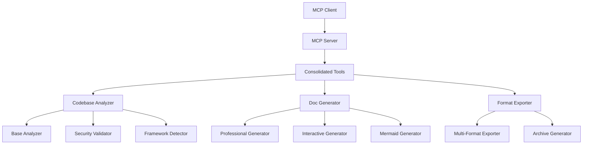
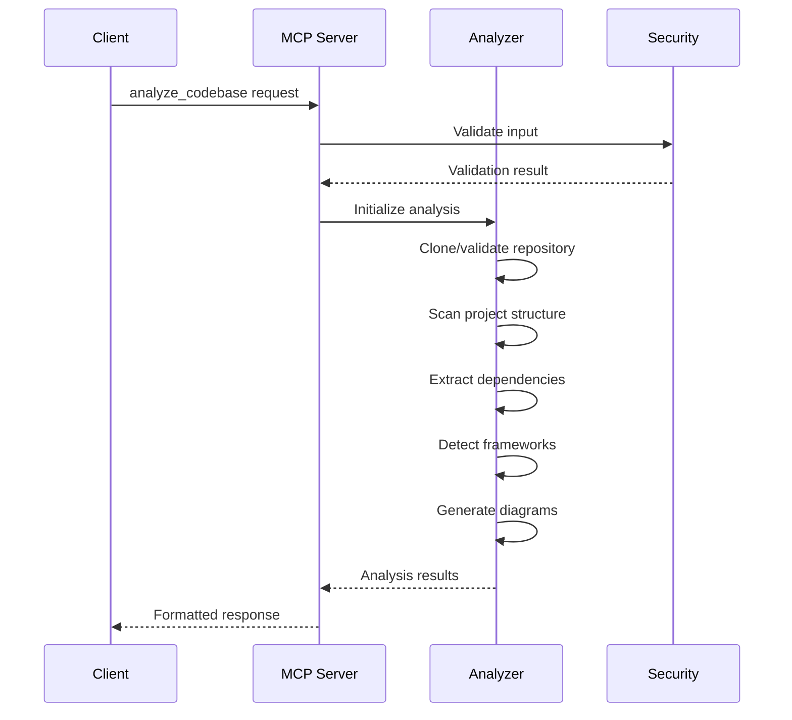
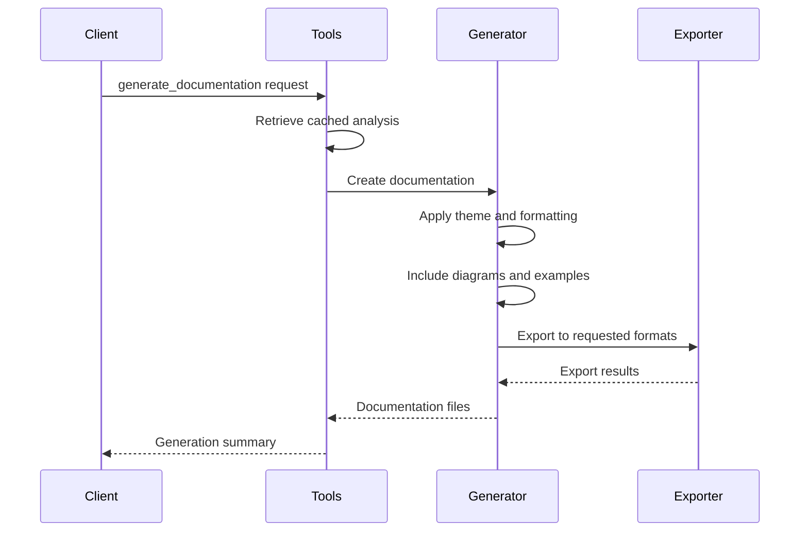

# Document-Automation: Comprehensive Project Documentation

A powerful Python-based MCP (Model Context Protocol) server that provides comprehensive codebase analysis and professional documentation generation capabilities.

## Table of Contents

- [Overview](#overview)
- [Features](#features)
- [Architecture](#architecture)
- [Prerequisites](#prerequisites)
- [Installation](#installation)
- [Configuration](#configuration)
- [Usage](#usage)
- [API Reference](#api-reference)
- [Project Structure](#project-structure)
- [How It Works](#how-it-works)
- [Development](#development)
- [Contributing](#contributing)
- [Troubleshooting](#troubleshooting)
- [License](#license)

## Overview

Document-Automation is a sophisticated MCP server that automates the process of analyzing codebases and generating comprehensive, professional documentation. It provides a single unified interface for performing complex analysis operations and creating documentation in multiple formats.

### Key Capabilities

- **Comprehensive Codebase Analysis**: Complete project structure analysis, dependency mapping, framework detection, and code complexity metrics
- **Professional Documentation Generation**: Creates publication-ready documentation with multiple themes and formats
- **Multi-Format Export**: Supports HTML, PDF, Markdown, Word documents, and more
- **Interactive Features**: Generates searchable, navigable documentation with live diagrams
- **Security-First**: Built-in validation and security analysis capabilities
- **Scalable Architecture**: Handles repositories of any size with intelligent pagination

## Features

### 🔍 **Advanced Analysis Engine**
- **Project Structure Mapping**: Complete directory tree analysis with file categorization
- **Dependency Analysis**: Comprehensive dependency extraction from multiple package managers
- **Framework Detection**: Automatic detection of web frameworks, libraries, and tech stack
- **Database Schema Analysis**: Extraction and documentation of database structures
- **API Endpoint Discovery**: Automatic detection and documentation of REST endpoints
- **Code Complexity Metrics**: Detailed analysis of code quality and complexity
- **Security Analysis**: Vulnerability scanning and security best practices validation

### 📖 **Professional Documentation Generation**
- **Multiple Themes**: Modern, minimal, corporate, GitHub, and material design themes
- **Interactive Elements**: Search functionality, navigation sidebars, collapsible sections
- **Rich Content**: Code examples, architecture diagrams, API documentation
- **Accessibility Compliance**: WCAG 2.1 AA compliant output
- **Multi-Language Support**: Documentation generation in multiple languages
- **Custom Branding**: Logo integration, custom CSS, and corporate styling

### 🚀 **Export & Integration**
- **Multiple Formats**: HTML, PDF, Markdown, DOCX, LaTeX, EPUB, and more
- **Archive Generation**: Automatic ZIP archives for easy distribution
- **Quality Optimization**: Image compression, HTML minification, and performance optimization
- **Validation**: Built-in validation for all exported formats
- **Batch Processing**: Export to multiple formats simultaneously

### 🛡️ **Security & Compliance**
- **Input Validation**: Comprehensive validation of all inputs and paths
- **Safe Repository Handling**: Secure cloning and analysis of external repositories
- **Privacy Protection**: Automatic sanitization of sensitive information
- **Access Controls**: User-based permissions and access management

## Architecture

The Document-Automation system follows a modular, service-oriented architecture:



### Core Components

1. **MCP Server Layer** (`src/server.py`)
   - Handles client connections and requests
   - Manages tool registration and routing
   - Provides standardized response formatting

2. **Consolidated Tools** (`src/tools/consolidated_documentation_tools.py`)
   - Primary interface for all documentation operations
   - Orchestrates analysis and generation workflows
   - Manages caching and result processing

3. **Analysis Engine** (`src/analyzers/`)
   - **Base Analyzer**: Abstract foundation for all analyzers
   - **Codebase Analyzer**: Language-specific analysis implementation
   - **Framework Detector**: Automatic technology stack detection
   - **Database Analyzer**: Schema extraction and analysis

4. **Documentation Generators** (`src/generators/`)
   - **Professional Generator**: Creates comprehensive, publication-ready docs
   - **Interactive Generator**: Builds searchable, navigable HTML documentation
   - **Mermaid Generator**: Creates architecture and flow diagrams

5. **Export System** (`src/export/`)
   - **Format Exporter**: Multi-format document export
   - **Archive Generator**: Creates distribution packages

6. **Security Layer** (`src/security/`)
   - Input validation and sanitization
   - Path traversal protection
   - Repository access controls

## Prerequisites

### System Requirements
- **Python**: 3.8 or higher
- **Memory**: 4GB RAM minimum (8GB recommended for large repositories)
- **Storage**: 1GB free space for temporary files and caches
- **Network**: Internet access for GitHub repository analysis

### Required Dependencies
```bash
# Core MCP and web framework
mcp>=1.13.0
pydantic>=2.11.0
fastapi>=0.116.0
uvicorn>=0.35.0

# Documentation generation
sphinx>=8.2.0
mkdocs>=1.6.0
reportlab>=4.4.0
beautifulsoup4>=4.13.5

# Data visualization
matplotlib>=3.10.0
plotly>=5.24.0
mermaid-py>=0.8.0

# Text processing and export
python-docx>=0.8.11
weasyprint>=59.0.0
```

### Optional Dependencies
```bash
# Advanced PDF generation
pandoc  # System package for enhanced document conversion

# Git operations (for repository analysis)
git  # System package

# Additional export formats
texlive  # For LaTeX export support
```

## Installation

### 1. Clone the Repository
```bash
git clone https://github.com/your-org/Document-Automation.git
cd "Document Automation"
```

### 2. Create Virtual Environment
```bash
# Using uv (recommended)
uv venv
uv pip install -r requirements.txt

# Or using standard Python
python -m venv .venv
.venv\Scripts\activate  # Windows
# source .venv/bin/activate  # Linux/Mac
pip install -r requirements.txt
```

### 3. Environment Configuration
Create a `.env` file in the project root:
```env
# Optional: Configure logging level
LOG_LEVEL=INFO

# Optional: Set custom cache directory
CACHE_DIR=./cache

# Optional: Configure maximum file size for analysis
MAX_FILE_SIZE=10485760  # 10MB

# Optional: Set timeout for operations
OPERATION_TIMEOUT=300  # 5 minutes
```

### 4. Verify Installation
```bash
.venv\Scripts\python.exe src\server.py --help
```

## Configuration

### Server Configuration
The server can be configured through environment variables or command-line arguments:

```python
# Environment Variables
LOG_LEVEL = "INFO"  # DEBUG, INFO, WARNING, ERROR
MAX_FILE_SIZE = 10 * 1024 * 1024  # 10MB
MAX_ANALYSIS_DEPTH = 10
CACHE_ENABLED = True
TEMP_DIR = "./temp"
```

### Analysis Configuration
Configure analysis behavior through the analyzer config:

```python
analyzer_config = {
    'include_dependencies': True,
    'include_ast_analysis': True,
    'include_framework_detection': True,
    'include_database_analysis': True,
    'include_api_endpoints': True,
    'include_security_analysis': True,
    'max_files': 1000,
    'max_tokens_per_chunk': 4000,
    'pagination_strategy': 'smart'
}
```

## Usage

### Starting the MCP Server
```bash
# Basic startup
.venv\Scripts\python.exe src\server.py

# With custom log level
.venv\Scripts\python.exe src\server.py --log-level DEBUG

# With custom configuration
LOG_LEVEL=DEBUG .venv\Scripts\python.exe src\server.py
```

### Using the MCP Tools

#### 1. Analyze Codebase
```json
{
  "tool": "analyze_codebase",
  "arguments": {
    "path": "https://github.com/user/repo",
    "source_type": "github",
    "include_dependencies": true,
    "include_framework_detection": true,
    "include_mermaid_diagrams": true,
    "pagination_strategy": "smart",
    "max_files": 1000
  }
}
```

#### 2. Generate Documentation
```json
{
  "tool": "generate_documentation",
  "arguments": {
    "analysis_id": "analysis_20250904_231121_6354",
    "format": "markdown",
    "theme": "modern",
    "title": "Project Documentation",
    "include_toc": true,
    "include_api_docs": true,
    "include_examples": true,
    "include_architecture": true,
    "include_mermaid_diagrams": true,
    "include_search": true,
    "include_navigation": true
  }
}
```

#### 3. Export Documentation
```json
{
  "tool": "export_documentation",
  "arguments": {
    "analysis_id": "analysis_20250904_231121_6354",
    "formats": ["html", "pdf", "docx"],
    "theme": "modern",
    "include_toc": true,
    "include_diagrams": true,
    "generate_archive": true,
    "quality_optimization": true
  }
}
```

### Programmatic Usage

```python
import asyncio
from src.tools.consolidated_documentation_tools import ConsolidatedDocumentationTools

async def main():
    tools = ConsolidatedDocumentationTools()
    
    # Analyze a repository
    analysis_result = await tools.analyze_codebase(
        path="https://github.com/user/repo",
        source_type="github",
        include_dependencies=True,
        include_mermaid_diagrams=True
    )
    
    # Extract analysis ID
    analysis_id = extract_analysis_id(analysis_result)
    
    # Generate documentation
    doc_result = await tools.generate_documentation(
        analysis_id=analysis_id,
        format="markdown",
        theme="modern",
        include_toc=True,
        include_api_docs=True
    )
    
    print("Documentation generated successfully!")

asyncio.run(main())
```

## API Reference

### Core Tools

#### `analyze_codebase`
Performs comprehensive codebase analysis with all features integrated.

**Parameters:**
- `path` (string, required): GitHub URL or local path
- `source_type` (string, required): "github" or "local"
- `include_dependencies` (boolean, default: true): Analyze dependencies
- `include_ast_analysis` (boolean, default: true): Perform AST parsing
- `include_framework_detection` (boolean, default: true): Detect frameworks
- `include_database_analysis` (boolean, default: true): Analyze database schemas
- `include_mermaid_diagrams` (boolean, default: true): Generate diagrams
- `include_api_endpoints` (boolean, default: true): Extract API endpoints
- `include_security_analysis` (boolean, default: true): Perform security analysis
- `max_files` (integer, default: 1000): Maximum files to analyze
- `pagination_strategy` (string, default: "smart"): Pagination approach

**Returns:**
```json
{
  "success": true,
  "analysis_id": "analysis_20250904_231121_6354",
  "comprehensive_analysis": { /* analysis data */ },
  "features_analyzed": { /* feature flags */ },
  "mermaid_diagrams": { /* diagram data */ },
  "analysis_statistics": { /* metrics */ }
}
```

#### `generate_documentation`
Generates comprehensive professional documentation.

**Parameters:**
- `analysis_id` (string, required): ID from previous analysis
- `format` (string, default: "professional"): Documentation style
- `theme` (string, default: "default"): Visual theme
- `title` (string, optional): Custom title
- `include_api_docs` (boolean, default: true): Include API documentation
- `include_examples` (boolean, default: true): Include code examples
- `include_architecture` (boolean, default: true): Include architecture docs
- `include_mermaid_diagrams` (boolean, default: true): Include diagrams
- `include_toc` (boolean, default: true): Include table of contents
- `include_search` (boolean, default: true): Include search functionality
- `include_navigation` (boolean, default: true): Include navigation

**Returns:**
```json
{
  "success": true,
  "documentation_title": "Project Documentation",
  "generated_files": [ /* file information */ ],
  "documentation_stats": { /* statistics */ },
  "features_included": { /* included features */ }
}
```

#### `export_documentation`
Exports documentation to multiple formats with advanced features.

**Parameters:**
- `analysis_id` (string, required): ID from previous analysis
- `formats` (array, required): List of export formats
- `theme` (string, default: "default"): Visual theme
- `title` (string, optional): Custom title
- `include_toc` (boolean, default: true): Include table of contents
- `include_diagrams` (boolean, default: true): Include diagrams
- `include_search` (boolean, default: true): Include search (where supported)
- `quality_optimization` (boolean, default: true): Optimize output
- `generate_archive` (boolean, default: false): Create ZIP archive

**Returns:**
```json
{
  "success": true,
  "export_results": [ /* export details */ ],
  "successful_exports": 3,
  "total_size_human": "2.5 MB",
  "archive_info": { /* archive details */ }
}
```

### Error Handling

All tools return consistent error responses:
```json
{
  "success": false,
  "error": "Detailed error message",
  "error_code": "VALIDATION_FAILED",
  "suggestions": ["Try checking the path", "Ensure repository is accessible"]
}
```

## Project Structure

```
Document Automation/
├── src/
│   ├── analyzers/           # Code analysis engines
│   │   ├── base_analyzer.py         # Abstract analyzer foundation
│   │   ├── codebase_analyzer.py     # Main codebase analysis
│   │   ├── database_analyzer.py     # Database schema analysis
│   │   └── framework_detector.py    # Technology stack detection
│   ├── diagrams/            # Diagram generation
│   │   ├── architecture_diagrams.py # System architecture diagrams
│   │   ├── database_diagrams.py     # Database ER diagrams
│   │   └── mermaid_generator.py     # Mermaid diagram creation
│   ├── export/              # Multi-format export system
│   │   └── format_exporter.py       # Export to various formats
│   ├── generators/          # Documentation generators
│   │   ├── documentation_generator.py    # Main documentation engine
│   │   ├── interactive_doc_generator.py  # Interactive HTML docs
│   │   └── professional_doc_generator.py # Professional documentation
│   ├── pagination/          # Large repository handling
│   │   ├── chunker.py              # Content chunking
│   │   ├── context.py              # Pagination context
│   │   ├── strategies.py           # Pagination strategies
│   │   └── token_estimator.py      # Token counting
│   ├── security/            # Security and validation
│   │   └── validation.py           # Input validation and security
│   ├── tools/               # MCP tool implementations
│   │   └── consolidated_documentation_tools.py # Main tool interface
│   ├── schemas.py           # Pydantic data models
│   ├── server.py            # MCP server implementation
│   └── __init__.py
├── requirements.txt         # Python dependencies
├── wrangler.toml           # Cloudflare Workers configuration
├── README.md               # Basic project information
└── .env                    # Environment configuration
```

### Key Files Description

- **`server.py`**: Main MCP server that handles client connections and tool routing
- **`consolidated_documentation_tools.py`**: Primary interface providing three main tools
- **`base_analyzer.py`**: Abstract foundation for all analysis operations
- **`professional_doc_generator.py`**: Creates publication-quality documentation
- **`schemas.py`**: Pydantic models for type safety and validation
- **`validation.py`**: Security validation and input sanitization
- **`requirements.txt`**: Comprehensive dependency list with version constraints

## How It Works

### 1. Analysis Phase


### 2. Documentation Generation


### 3. Security Model
- **Input Validation**: All paths and URLs are validated against security patterns
- **Sandboxed Execution**: Repository cloning and analysis occurs in isolated environments
- **Resource Limits**: File size, depth, and processing time limits prevent abuse
- **Data Sanitization**: Sensitive information is automatically redacted from outputs

## Development

### Setting up Development Environment

1. **Clone and Setup**
```bash
git clone https://github.com/your-org/Document-Automation.git
cd "Document Automation"
uv venv
uv pip install -r requirements.txt
```

2. **Install Development Tools**
```bash
uv pip install pytest pytest-asyncio black isort mypy
```

3. **Run Tests**
```bash
pytest tests/
```

4. **Code Formatting**
```bash
black src/
isort src/
```

### Architecture Decisions

- **MCP Protocol**: Chosen for standardized AI tool integration
- **Pydantic Models**: Ensures type safety and automatic validation
- **Async/Await**: Non-blocking operations for better performance
- **Modular Design**: Clear separation of concerns for maintainability
- **Plugin Architecture**: Easy extension with new analyzers and generators

### Adding New Features

#### Adding a New Analyzer
```python
from src.analyzers.base_analyzer import BaseAnalyzer

class CustomAnalyzer(BaseAnalyzer):
    async def _analyze_custom_feature(self):
        # Implementation here
        pass
```

#### Adding a New Export Format
```python
from src.export.format_exporter import BaseExporter

class CustomExporter(BaseExporter):
    def export_to_format(self, content, output_path):
        # Implementation here
        pass
```

## Contributing

We welcome contributions! Please see our contributing guidelines:

### Development Workflow
1. Fork the repository
2. Create a feature branch (`git checkout -b feature/amazing-feature`)
3. Make your changes with tests
4. Run the test suite (`pytest`)
5. Format your code (`black src/ && isort src/`)
6. Commit your changes (`git commit -m 'Add amazing feature'`)
7. Push to the branch (`git push origin feature/amazing-feature`)
8. Open a Pull Request

### Code Standards
- **Type Hints**: Use Python type hints for all function signatures
- **Documentation**: Include docstrings for all public methods
- **Testing**: Write tests for new functionality
- **Security**: Follow security best practices for input handling
- **Performance**: Consider performance implications of changes

### Issue Reporting
When reporting issues, please include:
- Python version and operating system
- Full error message and stack trace
- Steps to reproduce the issue
- Expected vs actual behavior

## Troubleshooting

### Common Issues

#### "BaseModel.__init__() takes 1 positional argument but 3 were given"
This error typically occurs when Pydantic models are instantiated with positional arguments instead of keyword arguments.

**Solution**: Ensure all Pydantic model instantiations use keyword arguments:
```python
# Incorrect
model = MyModel("value1", "value2")

# Correct
model = MyModel(field1="value1", field2="value2")
```

#### Git Authentication Issues
When analyzing private repositories, authentication may be required.

**Solution**: Set up Git credentials or use SSH keys:
```bash
git config --global user.name "Your Name"
git config --global user.email "your.email@example.com"
```

#### Memory Issues with Large Repositories
Large repositories may cause memory issues during analysis.

**Solutions**:
- Increase pagination chunk size: `max_tokens_per_chunk: 2000`
- Enable background processing: `background_processing: true`
- Limit file count: `max_files: 500`

#### PDF Generation Issues (WeasyPrint)
WeasyPrint may have missing system dependencies on some systems.

**Solutions**:
- **Windows**: Install GTK+ development libraries
- **Linux**: `sudo apt-get install libgtk-3-dev libcairo2-dev`
- **macOS**: `brew install cairo gtk+3`

#### Permission Denied Errors
May occur when analyzing repositories with restricted file permissions.

**Solution**: Ensure the user has read permissions for the target directory:
```bash
chmod -R +r /path/to/repository
```

### Performance Optimization

#### For Large Repositories
```python
config = {
    'pagination_strategy': 'smart',
    'max_files': 1000,
    'background_processing': True,
    'include_ast_analysis': False  # Disable for speed
}
```

#### For Better Documentation Quality
```python
config = {
    'include_all_features': True,
    'quality_optimization': True,
    'generate_archive': True,
    'accessibility_compliance': True
}
```

### Getting Help

- **Documentation**: Check this comprehensive guide first
- **Issues**: Search existing issues on GitHub
- **Discussions**: Join community discussions
- **Support**: Contact the development team

## License

This project is licensed under the MIT License - see the [LICENSE](LICENSE) file for details.

### Third-Party Libraries
This project uses several third-party libraries, each with their own licenses:
- FastAPI (MIT License)
- Pydantic (MIT License)
- Matplotlib (PSF License)
- ReportLab (BSD License)
- BeautifulSoup4 (MIT License)

---

**Document-Automation** - Turning code into comprehensive, professional documentation with the power of AI and automation.

Generated on: 2025-09-04T17:41:47Z  
Version: 1.0.0  
MCP Server: document-automation-server
